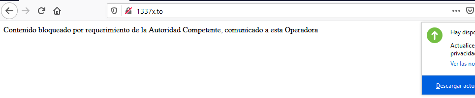
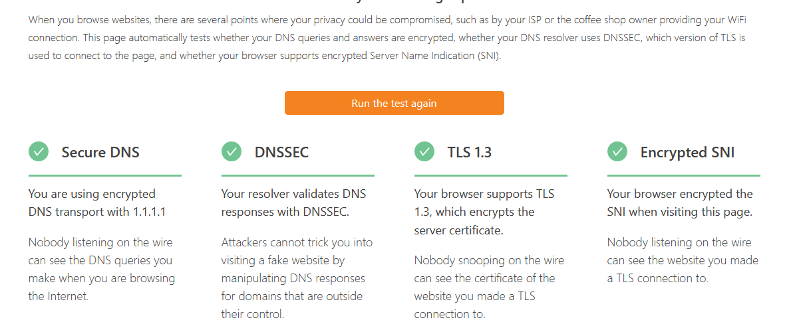
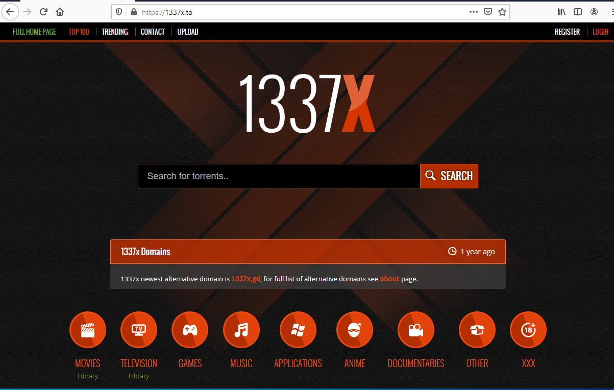

# Como nos bloquea la *"Autoridad Competente"* las paginas web.

Vas a una pagina de torrents, lo más típico que están bloqueando a dia de hoy, y cuando accedes o te sale un error de que hay un certificado no válido,
o si quitas la encriptacion de https, te bajas al viejo http te sale el mensaje de *Contenido bloqueado por requerimiento de la Autoridad Competente,
comunicado a esta Operadora*, os animo a probarlo visitando la web que usaré de ejemplo http://1337x.to un sitio de piratas al sur del caribe, donde vereis 
ese mensaje.

## Como bloquean?

Antes creo que se hacia por DNS, simplemente los DNS no resolvian la ip del dominio, pero ésto se lo salta el mas necio, cambiar los DNS por los de 
Google y a correr, esto lo cambiaron, yo pensaba que bloqueaban la ip, pero no tiene sentido, 1337x está alojado en Cloudfront, si bloquean la ip del 
servidor, bloquearian miles de webs, un poco de teoria:

La especificación HTTP/1.1 añade que cuando conectas a un servidor y le pides una pagina web, lo haces con GET /index.html HTTP/1.1 estás obligado a 
especificar el Host, el nombre de la web, así puedes tener un mismo servidor 104.21.9.48 que sirve miles de Host diferentes, cuando te conectas a una
de las ips de Cloudfront (104.21.9.48) si no especificas un Host te sale un error, no te dan ninguna web, porqué no saben cual quieres.

Aqui viene lo gracioso, si usas un navegador como Curl en linea de comando y le añades **Host: 1337x.to** a las cabeceras de la petición, 
ya sabes el mensaje que te sale, si hacemos un cambio mínimo, por ejemplo un subdominio existente, esto lo podeis probar en el navegador normal 
**https://chat.1337x.to** te aparece una web de un cliente de chat, que imagino usaran en dicha web.

Esto evidencia el método que usan para bloquear las webs, **tu proveedor de internet está monitorizando todas las cabeceras de las webs** que visitas
(ay pillin!) y cuando pides una que está en el listado que la *Autoridad Competente* estima que no es correcta te bloquean

## Como me lo salto?(Tiene truco)

La respuesta no es sencilla, un DNS encriptado no vale, la petición que haces al servidor DNS no la ven, pero la cabecera cuando accedes a la web si 
que la ven, porque va en texto plano. Cloudfare sacó recientemente una herramienta para probar si tu DNS está encriptado 
https://www.cloudflare.com/ssl/encrypted-sni/

Si haces el test, las tres primeras pruebas las vas a pasar, la cuarta no,el test número cuatro es la opción  interesante **Encrypted SNI** 
no es más que un nuevo protocolo para hacer que las cabeceras, sobre todo la **HOST** que mandamos a Cloudfare vayan encriptadas, esto es 
algo muy nuevo, tan nuevo que pocos sitios lo soportan, Cloudfront es uno de ellos,si usas **Mozilla Firefox 84** y activas
la opcion en *about:config -> network.security.esni.enabled = True* y si visitas el test de Cloudfron te saldrán las cuatro pruebas en verde.

Ahora tan solo has de ir a https://1377x.to y como por arte de magia el bloqueo de la *Autoridad Competente* te lo pasas por el arco del triunfo.

## El truco

El *truco* es que necesitas **Firefox 84**, si tienes una versión mas moderna, como la 88 que es la actual el soporte ESNI ha desparecido, por lo visto 
no es 100% segura y se ha dejado de lado en favor de ECH (https://blog.cloudflare.com/encrypted-client-hello/) que es una cosa que debe hacer lo mismo que ESNI, pero mejor y que desgraciadamente ahora mismo no la soporta nadie, ni siquiera Cloudfare.
El otro truco que sería quedarse con la version del Firefox antigua tampoco es muy efectiva, porque el ESNI lo soporta Cloudfare, pero posiblemente 
muchos otros hosting no, así que tampoco es una solución efectiva.

## El Futuro

En cuanto alguno de éstos formas de encriptar nuestras comunicaciones se estandaricen, éstos métodos ya no servirán para bloquear los
contenidos de manera tan alegre como ahora hacen, pero por ahora les sirven, sobre todo para espiar las paginas que visitas.

